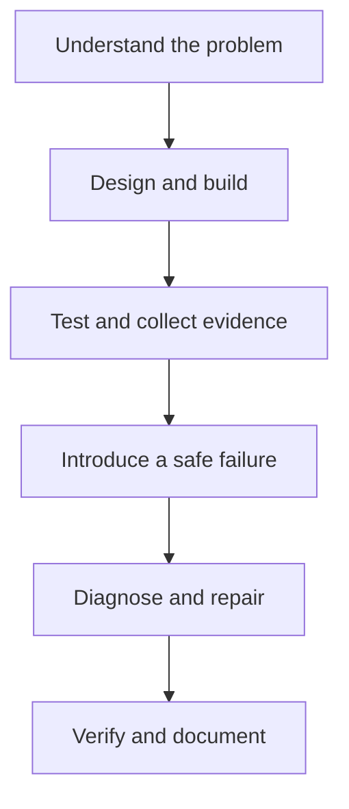

# Junior Linux Portfolio Projects

Build practical Linux systems. Break them safely. Diagnose the failure. Restore service. Document the result.

This collection contains ten guided, portfolio-ready projects for people learning Linux administration for the first time. The projects begin with local users and permissions, then progress through security, backups, storage, web services, monitoring, logs, remote administration, service reliability, and Bash CLI development.

These are not command-copying exercises. Every project starts with a realistic operational problem and ends with evidence that the learner can build, test, troubleshoot, and explain a working solution.

## Who This Is For

These projects are designed for:

- learners with basic command-line experience;
- aspiring Linux administrators, cloud engineers, DevOps engineers, and support engineers;
- students who need practical work for a GitHub portfolio;
- professionals who want structured Linux practice in a safe lab.

No production server is required. Complete the projects in disposable virtual machines or another isolated lab environment.

## What You Will Build

| # | Project | Real-world outcome | Main skills |
|---:|---|---|---|
| 1 | [Linux User & Access Management System](./01-user-access-management/) | A controlled multi-user Linux environment with least-privilege administration | Users, groups, permissions, sudo, Bash |
| 2 | [Linux Server Security Hardening](./02-server-security-hardening/) | A hardened server with reduced attack surface and protected remote access | SSH, firewall, access controls, services |
| 3 | [Automated Linux Backup & Restore System](./03-backup-restore-system/) | A scheduled, versioned backup system with tested restoration | Bash, cron, storage, disaster recovery |
| 4 | [Linux Storage Management Environment](./04-storage-management/) | A managed storage environment with persistent mounts and fault diagnosis | Partitions, filesystems, LVM, monitoring |
| 5 | [Production-Style Linux Web Server](./05-production-web-server/) | A secured and observable web server hosting a real site | Nginx or Apache, firewall, logs, permissions |
| 6 | [Linux Server Monitoring Tool](./06-server-monitoring-tool/) | A health-monitoring tool with thresholds, reports, and alerts | Bash, CPU, memory, disk, processes |
| 7 | [Linux Log Analysis & Security Tool](./07-log-analysis-security-tool/) | A reusable tool for finding authentication failures and system problems | Logs, Bash, security analysis, troubleshooting |
| 8 | [Remote Linux Administration Toolkit](./08-remote-administration-toolkit/) | A secure toolkit for administering several Linux hosts | SSH keys, networking, automation, file transfer |
| 9 | [Linux Service Reliability Project](./09-service-reliability/) | Services that start automatically, recover from failure, and produce useful logs | systemd, restart policies, logging, diagnostics |
| 10 | [Linux System Administration CLI](./10-system-administration-cli/) | A reusable command-line tool for Linux health checks and diagnostics | Bash, CLI design, validation, Linux administration |

## How Every Project Works

Every project follows the same learning cycle so that the process becomes familiar and repeatable.




Commands are part of the implementation, not the entire project. Learners should understand why a command is used, how to verify it, and how to recover if it fails.


## Recommended Learning Path

Complete the projects in order. Each stage reuses skills learned earlier.

| Stage | Projects | Focus |
|---|---|---|
| Foundation | 1-2 | Identity, authorization, least privilege, host security |
| Data and infrastructure | 3-4 | Recovery, scheduling, disks, filesystems, persistent storage |
| Operations | 5-7 | Service deployment, observability, logs, security signals |
| Administration at scale | 8-9 | Remote operations, repeatability, service recovery |
| Capstone | 10 | Combine diagnostics and automation into a reusable product |

## Before You Begin

### Required lab

Use an isolated environment that can be reset:

- one Ubuntu Server LTS or another supported Linux virtual machine;
- two or three virtual machines for the remote-administration project;
- a non-root account with `sudo` access;
- Git and a text editor;
- a VM snapshot taken before security, storage, and failure exercises.

The commands in individual guides should clearly identify their supported distribution. Do not assume that package names, service names, configuration paths, or firewall tools are identical across distributions.

### Command conventions

Project guides should use these conventions:

```bash
# Run as the current non-root user
command --option value

# Run with temporary administrative privileges
sudo command --option value
```

- Replace values such as `<username>` and `<server-ip>` before running a command.
- Never paste a command containing a placeholder without reviewing it.
- Read the explanation and expected effect before execution.
- Run verification commands after every meaningful change.
- Record unexpected output instead of hiding it.

## Safety Rules

Some exercises change authentication, firewalls, disks, services, and scheduled jobs. A mistake can remove access or destroy data.

- Work only in a lab that you own or are authorized to use.
- Never test destructive commands against a production machine.
- Keep the current SSH session open while testing a new SSH configuration.
- Validate SSH configuration before restarting or reloading the service.
- Confirm disk device names with more than one command before partitioning or formatting.
- Back up configuration files before changing them.
- Prefer service reloads when they safely apply a validated configuration.
- Use dedicated test data for backup, restore, and deletion exercises.
- Review scripts before running them with `sudo`.
- Follow the cleanup section when a project is complete.

## What Counts as Portfolio Evidence

A finished project should prove both the implementation and the learner's reasoning. Include:

- an architecture diagram;
- the project requirements and assumptions;
- sanitized configuration files;
- readable scripts with comments and usage instructions;
- selected command output showing successful verification;
- screenshots only when they add information not captured by text;
- test cases and their results;
- one documented failure, diagnosis, repair, and recovery check;
- security decisions and known limitations;
- a short results summary;
- a resume bullet and interview talking points.

Do not commit passwords, private keys, API tokens, real IP inventories, personal log data, or unredacted sensitive output. Use examples and sanitized evidence.

## Definition of Done

A project is complete when a reviewer can answer **yes** to all of the following:

- Does the repository explain the problem before presenting the solution?
- Can a first-time learner prepare the required environment safely?
- Are commands, options, scripts, and configuration changes explained?
- Is expected output shown without implying that every system will be identical?
- Does each major step include a verification check?
- Is a realistic failure introduced safely and intentionally?
- Does the troubleshooting record connect symptoms to a root cause?
- Is recovery verified after the fix?
- Are cleanup or rollback instructions provided?
- Does the evidence support the claimed result?
- Can the learner explain the project in an interview without relying on memorized commands?

## Suggested Results Format

End each project with a short results table.

| Measure | Before | After | Evidence |
|---|---|---|---|
| Example: administrative access | Broad or undocumented | Limited to an approved group | `getent group`, sudo policy test |
| Example: service recovery | Manual restart required | Automatic restart verified | systemd status and journal output |
| Example: backup recovery | Untested | Test file restored successfully | checksum comparison |

Use measurements that fit the project. Avoid vague claims such as “more secure” or “works better” without evidence.

## Resume and Interview Preparation

A strong resume bullet names the system, the implementation, and the verified outcome.

> Built a least-privilege Linux access management environment using users, groups, filesystem permissions, and scoped sudo policies; tested unauthorized access and documented successful remediation and audit evidence.

Be ready to explain:

- the problem the project solved;
- the architecture and major technical decisions;
- the security controls and tradeoffs;
- the failure that was introduced;
- the diagnostic process and root cause;
- the evidence that proved recovery;
- what would need to change for production use.

## Using This Repository

1. Fork or clone the repository.
2. Read the selected project's entire README before changing the lab.
3. Create the required virtual machines and snapshots.
4. Replace documented placeholders with lab-specific values.
5. Complete each implementation step and its verification check.
6. Perform the controlled failure only when the guide instructs you to do so.
7. Save sanitized evidence in the project directory.
8. Complete the results, resume bullet, and interview questions in your own words.
9. Run cleanup steps or restore the original snapshot.
10. Commit the completed project with a clear summary.

## Academic and Professional Integrity

The supplied scripts, commands, and examples are learning tools. A portfolio should reflect the learner's own environment, decisions, test results, and explanation. Do not claim sample output as personal evidence. Document adaptations, mistakes, and lessons learned. Honest troubleshooting is often stronger evidence than a perfect first attempt.


Start with [Project 1: Linux User & Access Management System](./01-user-access-management/) and build the habits that every later project depends on: understand the requirement, make one controlled change, verify the result, and document the evidence.
