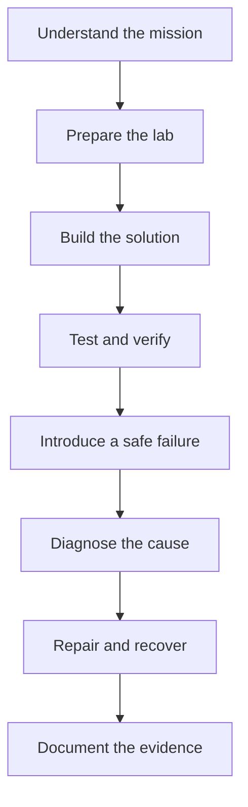

# Junior Linux Portfolio Projects

Practical Linux projects built around real administration problems, guided implementation, controlled failures, troubleshooting, recovery, and portfolio evidence.

The Junior Linux Projects collection turns foundational Linux knowledge into working systems. Each project places learners in a realistic scenario and guides them through planning, implementation, verification, failure diagnosis, repair, and documentation.

The goal is not to memorize commands. The goal is to understand what each command changes, prove that the solution works, recognize failure symptoms, and recover the system safely.

## Start Here

These projects are designed for learners who understand basic terminal navigation and want practical Linux administration experience.

Each project includes:

- a realistic technical scenario;
- clearly defined requirements;
- a visual architecture explanation;
- step-by-step environment preparation;
- exact commands and scripts;
- explanations of commands, options, files, and paths;
- representative expected output;
- verification after every major change;
- a controlled failure scenario;
- diagnostic commands and troubleshooting guidance;
- recovery verification;
- safe cleanup instructions;
- portfolio evidence requirements;
- resume and interview preparation.

## Project Workflow

Every project follows the same operational cycle.



This structure reflects how Linux administrators work. A system is not complete simply because a command ran without an error. It must satisfy its requirements, survive testing, expose useful diagnostic information, and recover predictably.

## The Projects

### 01. Linux User and Access Management System

Build a controlled multi-user Linux environment for a small application team.

Create users and groups, design an access model, configure shared directories, apply ownership and permissions, delegate limited administrative access through `sudo`, test authorized and unauthorized actions, and audit the final configuration.

**What you will demonstrate:** Linux administration, users, groups, file permissions, ownership, sudo, Bash, access testing, and auditing.

[Open Project 01](./01-user-access-management/)

### 02. Linux Server Security Hardening

Transform a fresh Linux server into a safer administrative environment.

Review the server baseline, secure SSH access, configure firewall rules, remove or disable unnecessary services, strengthen account controls, inspect listening ports, test access restrictions, and recover from a deliberate security misconfiguration.

**What you will demonstrate:** Linux security, SSH, firewall management, service reduction, access control, validation, and recovery.

[Open Project 02](./02-server-security-hardening/)

### 03. Automated Linux Backup and Restore System

Build an automated backup system that proves data can be recovered.

Identify important data, create versioned backups, verify archive integrity, schedule recurring jobs, apply retention rules, log each run, simulate data loss, restore selected files, and confirm the restored data with checksums.

**What you will demonstrate:** Bash, archives, cron or systemd timers, storage, logging, retention, restoration, and disaster recovery.

[Open Project 03](./03-backup-restore-system/)

### 04. Linux Storage Management Environment

Design and operate a Linux storage environment with persistent, monitored filesystems.

Inspect block devices, prepare lab disks, create partitions and filesystems, configure mount points, manage permissions, create persistent mounts, work with LVM, monitor capacity, introduce a mount failure, diagnose the cause, and restore storage access.

**What you will demonstrate:** Block devices, partitions, filesystems, mounting, `/etc/fstab`, LVM, permissions, capacity monitoring, and troubleshooting.

[Open Project 04](./04-storage-management/)

### 05. Production-Style Linux Web Server

Deploy a secured Linux web server capable of hosting a real website.

Install and configure Nginx or Apache, publish site content, apply safe ownership and permissions, configure firewall access, manage the service with systemd, inspect access and error logs, test the website, introduce a configuration failure, and restore service.

**What you will demonstrate:** Linux administration, Nginx or Apache, networking, firewall rules, permissions, systemd, log monitoring, and service recovery.

[Open Project 05](./05-production-web-server/)

### 06. Linux Server Monitoring Tool

Create a reusable monitoring tool that reports server health and warns when thresholds are exceeded.

Collect CPU, memory, disk, load, uptime, and process information. Add configurable thresholds, status messages, logs, exit codes, scheduled execution, and alert behavior. Generate a controlled resource problem and confirm that the tool detects it.

**What you will demonstrate:** Bash, system metrics, processes, thresholds, logging, alert logic, automation, and health verification.

[Open Project 06](./06-server-monitoring-tool/)

### 07. Linux Log Analysis and Security Tool

Build a command-line tool that turns Linux logs into useful security and troubleshooting information.

Analyze authentication failures, sudo activity, service errors, repeated events, and suspicious patterns. Add filters, summaries, date ranges, output reports, and input validation. Generate safe test events, locate them in the logs, and explain what the evidence shows.

**What you will demonstrate:** Linux logging, `journalctl`, text processing, Bash, authentication analysis, pattern detection, reporting, and troubleshooting.

[Open Project 07](./07-log-analysis-security-tool/)

### 08. Remote Linux Administration Toolkit

Create a secure toolkit for administering multiple Linux machines from one management host.

Configure SSH keys, protect private key material, define client settings, execute remote commands, transfer files, collect system information, handle unreachable hosts, test failed authentication, and automate repeatable administration tasks.

**What you will demonstrate:** SSH, key-based authentication, networking, remote commands, secure file transfer, Bash automation, error handling, and multi-host administration.

[Open Project 08](./08-remote-administration-toolkit/)

### 09. Linux Service Reliability Project

Deploy and manage Linux services that start automatically, recover from failure, and produce useful operational logs.

Create systemd service units, define dependencies, set restart policies, manage environment files, inspect unit state, follow logs, simulate a service crash, identify the failure reason, repair the service, and verify automatic recovery.

**What you will demonstrate:** systemd, unit files, service dependencies, restart policies, journald, process management, failure analysis, and recovery testing.

[Open Project 09](./09-service-reliability/)

### 10. Linux System Administration CLI

Build a reusable command-line application for common Linux health checks and diagnostics.

Design commands for system information, CPU and memory health, disk usage, process inspection, network checks, and service status. Add help output, arguments, validation, exit codes, logging, tests, and safe error handling.

**What you will demonstrate:** Bash scripting, CLI design, functions, arguments, input validation, exit codes, Linux diagnostics, testing, and documentation.

[Open Project 10](./10-system-administration-cli/)

## Recommended Learning Order

Complete the projects in numerical order. Later projects reuse skills established in earlier work.

| Stage | Projects | Focus |
|---|---:|---|
| Access and security | 01 to 02 | Identity, permissions, administrative access, host protection |
| Data and storage | 03 to 04 | Backups, restoration, filesystems, persistent storage |
| Service operations | 05 to 07 | Deployment, monitoring, logs, security signals |
| Remote reliability | 08 to 09 | Multi-host administration, service management, recovery |
| Junior capstone | 10 | Combine Linux diagnostics and Bash into a reusable tool |

## Before You Begin

### Recommended environment

- Ubuntu Server 24.04 LTS, unless a project states otherwise;
- one virtual machine for Projects 01 to 07, 09, and 10;
- two or three virtual machines for Project 08;
- a non-root user with `sudo` access;
- Git and a text editor;
- virtual machine snapshots for rollback;
- internet access for package installation.

The projects use Ubuntu as the primary teaching environment. Commands, service names, package names, and file paths may differ on Debian, Red Hat Enterprise Linux, Rocky Linux, AlmaLinux, Fedora, or other distributions.

### Expected knowledge

Before starting, learners should be able to:

- open a terminal;
- navigate with `pwd`, `ls`, and `cd`;
- create and inspect files;
- use a text editor;
- run a command with `sudo`;
- read basic command output.

Learners who need these foundations should begin with [00 Start Here](../../00-Start-Here/) and [01 Beginner to Advanced](../../01-Beginner-to-Advanced/).

## How to Complete a Project

1. Read the scenario, goal, architecture, and safety notes.
2. Prepare the required virtual machines and take snapshots.
3. Record the starting state before making changes.
4. Follow each implementation step in order.
5. Read the command explanation before execution.
6. Compare the result with the representative expected output.
7. Run the verification command before continuing.
8. Complete the controlled failure exercise.
9. Diagnose the problem from evidence before applying the fix.
10. Repair the root cause and verify recovery.
11. Save sanitized evidence and complete the project documentation.
12. Run the cleanup steps or restore the lab snapshot.

## Command Conventions

Commands appear in code blocks.

```bash
# Run as the current non-root user
command --option value

# Run with temporary administrative privileges
sudo command --option value
```

Values inside angle brackets are placeholders.

```bash
ssh <username>@<server-ip>
```

Replace `<username>` and `<server-ip>` with values from the lab before running the command. Never paste a command containing an unresolved placeholder.

Expected output is representative. Hostnames, timestamps, process identifiers, package versions, device names, addresses, and resource values will differ between systems.

## Safety

These projects modify authentication, permissions, firewall rules, disks, filesystems, services, and scheduled tasks. Complete them only in an isolated lab that can be restored.

- Do not run destructive exercises on production systems.
- Keep an existing SSH session open while testing SSH changes.
- Validate configuration files before reloading services.
- Confirm storage device names before partitioning or formatting.
- Use dedicated test data for backup and deletion exercises.
- Back up configuration files before editing them.
- Read scripts before running them with `sudo`.
- Never expose a lab SSH service directly to the internet without appropriate controls.
- Follow each project's cleanup or rollback instructions.

## Portfolio Evidence

Each completed project should contain enough evidence for another person to understand what was built, how it was tested, and how it recovered from failure.

Recommended evidence includes:

- a project summary and requirements;
- an architecture diagram;
- sanitized configuration files;
- scripts with comments and usage instructions;
- selected command output;
- verification and test results;
- a controlled failure report;
- diagnostic findings and root cause;
- recovery evidence;
- security decisions and limitations;
- a results table;
- a resume bullet;
- interview questions and answers.

Do not commit passwords, private keys, access tokens, personal data, real infrastructure inventories, or unredacted sensitive logs.

## Project Completion Checklist

- [ ] The lab was prepared safely.
- [ ] The starting state was recorded.
- [ ] The required system was implemented.
- [ ] Every major change was verified.
- [ ] The scripts and configuration files were reviewed.
- [ ] The expected access or service behavior was tested.
- [ ] The controlled failure was reproduced.
- [ ] Diagnostic evidence was collected.
- [ ] The root cause was identified.
- [ ] The problem was repaired.
- [ ] Recovery was verified.
- [ ] Sensitive information was removed from the evidence.
- [ ] Cleanup or rollback was completed.
- [ ] The architecture, decisions, results, and lessons were documented.

## Repository Structure

```text
Junior/
├── README.md
├── 01-user-access-management/
├── 02-server-security-hardening/
├── 03-backup-restore-system/
├── 04-storage-management/
├── 05-production-web-server/
├── 06-server-monitoring-tool/
├── 07-log-analysis-security-tool/
├── 08-remote-administration-toolkit/
├── 09-service-reliability/
└── 10-system-administration-cli/
```

## From Project Work to Portfolio Proof

| Area | Evidence |
|---|---|
| Requirement | A clear statement of what the system must achieve |
| Implementation | Commands, scripts, configurations, and technical decisions |
| Security | Access restrictions, validation, and safe handling of sensitive data |
| Testing | Successful and unsuccessful test cases |
| Troubleshooting | Symptoms, observations, commands, findings, and root cause |
| Recovery | Proof that the repaired system works correctly |
| Result | A measurable before-and-after comparison |
| Communication | Architecture, documentation, resume bullet, and interview explanation |

The strongest portfolio projects do not hide mistakes. They show a disciplined investigation and a verified recovery.


## License

Linux World is distributed under the terms defined in the repository [LICENSE](../../LICENSE) and [NOTICE](../../NOTICE.md). Review those terms before copying, modifying, or redistributing project content.

---

Begin with [Project 01: Linux User and Access Management System](./01-user-access-management/).
