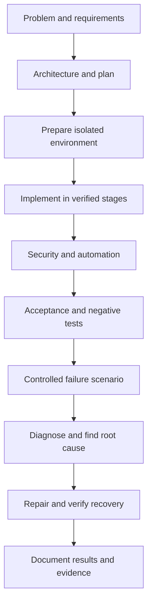

# Linux World Portfolio Projects

Build practical Linux systems. Solve realistic infrastructure problems. Produce evidence that can be reviewed, tested, discussed, and presented in a technical portfolio.

The Linux World project collection contains 30 portfolio projects across Junior, Mid-Level, and Senior levels. Each project begins with a business or technical problem and requires a working solution. The goal is not to copy commands. The goal is to understand the environment, make defensible engineering decisions, implement the system, test it, break it safely, recover it, and explain the result.

> A project is complete only when the system works, the required tests pass, the failure scenario is diagnosed, recovery is verified, and the documentation allows another learner to reproduce the result.

## What makes these portfolio projects

Every project produces reviewable engineering evidence:

- A defined problem and measurable outcome
- Requirements, assumptions, and constraints
- An architecture or system-flow diagram
- A reproducible Linux environment
- Commands, scripts, configuration files, and automation
- Security decisions and access controls
- Positive, negative, and failure testing
- Troubleshooting evidence and root-cause analysis
- Recovery and cleanup procedures
- A final case study, resume bullet, and interview discussion points

These are production-style laboratory projects. They demonstrate engineering methods in controlled environments. They must not be described as professional production experience unless the work was performed in an authorized production role.

## Choose a project level

| Level | Projects | Main focus | Recommended starting point |
|---|---:|---|---|
| [Junior](Junior/README.md) | 10 | Single-server administration, security, storage, services, Bash, monitoring, and troubleshooting | New Linux administrators and learners building their first technical portfolio |
| [Mid-Level](Mid-Level/README.md) | 10 | Multi-service and multi-server platforms, automation, centralized operations, containers, CI/CD, and incident response | Learners who can administer one Linux server independently |
| [Senior](Senior/README.md) | 10 | Architecture, high availability, identity, Kubernetes, observability, disaster recovery, performance, and reliability | Experienced administrators and infrastructure engineers ready to defend design trade-offs |

## Required project lifecycle

Every Linux World project follows the same engineering lifecycle.



The implementation guide must place each command beside its explanation, expected result, and verification command. Large scripts may be supplied as optional automation after the learner understands the manual implementation.

## Portfolio project standard

Every project must contain the following sections.

### 1. Problem

Describe the business or technical problem. Explain who is affected, what currently fails or is missing, and why the problem matters.

### 2. Requirements

Define functional requirements, security requirements, operational requirements, constraints, assumptions, and measurable acceptance criteria.

### 3. Architecture

Show the components, identities, network paths, storage paths, trust boundaries, dependencies, and expected data flow. The diagram must explain the system, not merely decorate the page.

### 4. Environment

State the supported distribution, version, VM or host requirements, CPU, memory, storage, network arrangement, packages, privileges, and snapshot requirements.

### 5. Implementation

Guide the learner through one controlled change at a time. Every important command must include:

- The directory from which it is executed
- The user or service identity that executes it
- Whether `sudo` is required
- A complete command or configuration file
- An explanation of the command, flags, variables, paths, and fields
- Representative expected output
- An independent verification command
- A checkpoint that must pass before continuing

### 6. Security

Explain identities, privileges, permissions, exposed services, firewall rules, authentication, secret handling, patching, auditability, and remaining risks.

### 7. Automation

Automate repeatable work with Bash, Python, Ansible, systemd timers, cron, or an appropriate platform tool. Automation must be safe to repeat or clearly describe its repeatability limits.

### 8. Testing

Include functional tests, security tests, negative tests, configuration validation, service checks, data-integrity checks, and final acceptance tests. Tests must inspect the real project result, not the existence of documentation files.

### 9. Failure scenario

Introduce a safe, deliberate, reversible failure. State the expected symptom and which acceptance check should fail.

### 10. Troubleshooting

Use an evidence-led investigation:

```text
symptom
  -> blast radius
  -> recent changes
  -> metrics, logs, events, processes, sockets, files, and configuration
  -> competing hypotheses
  -> smallest safe test
  -> root cause
  -> mitigation
  -> repair
  -> recovery verification
  -> prevention
```

### 11. Documentation

Include a runbook, change record, decision record, troubleshooting notes, cleanup procedure, and enough information for another learner to reproduce the system.

### 12. Results

Compare the final result with the original acceptance criteria. Include measured evidence, remaining limitations, lessons learned, and what would change in a real production environment.

### 13. Resume bullet

Write a concise, truthful bullet describing what was designed, implemented, automated, secured, tested, and measured. Identify the work as a laboratory or portfolio project when appropriate.

### 14. Interview questions

Prepare questions that test design reasoning, Linux knowledge, failure diagnosis, trade-offs, security decisions, and recovery understanding.

## Junior Linux portfolio projects

Junior projects build confidence operating one Linux server. They provide the most detailed implementation guidance, but learners must still explain every important decision and prove the result.

| # | Project | Portfolio outcome | Demonstrates |
|---:|---|---|---|
| 01 | [Linux User and Access Management System](Junior/01-Linux-User-and-Access-Management-System/README.md) | A secured identity and authorization environment with users, groups, permissions, sudo policy, access testing, and audit evidence | Linux administration, users and groups, permissions, sudo, Bash |
| 02 | [Linux Server Security Hardening](Junior/02-Linux-Server-Security-Hardening/README.md) | A fresh server transformed into a documented hardened baseline | Linux security, SSH, firewall, system administration |
| 03 | [Automated Linux Backup and Restore System](Junior/03-Automated-Linux-Backup-and-Restore-System/README.md) | Versioned backups, retention, scheduling, integrity checks, and a proven restore | Bash, cron or timers, storage, automation, disaster recovery |
| 04 | [Linux Storage Management Environment](Junior/04-Linux-Storage-Management-Environment/README.md) | A managed storage stack with partitions or disposable devices, filesystems, mounts, permissions, monitoring, and recovery evidence | Storage administration, filesystems, LVM, troubleshooting |
| 05 | [Production-Style Linux Web Server](Junior/05-Production-Style-Linux-Web-Server/README.md) | A secured NGINX or Apache server hosting a real site with controlled access, firewall policy, logs, and service operations | Linux administration, web servers, networking, security |
| 06 | [Linux Server Monitoring Tool](Junior/06-Linux-Server-Monitoring-Tool/README.md) | A working monitoring tool with thresholds, alerts, logs, exit codes, and failure tests | Bash, monitoring, system administration, automation |
| 07 | [Linux Log Analysis and Security Tool](Junior/07-Linux-Log-Analysis-and-Security-Tool/README.md) | A repeatable log-analysis tool that identifies suspicious authentication activity and recurring failures | Linux logging, Bash, security analysis, troubleshooting |
| 08 | [Remote Linux Administration Toolkit](Junior/08-Remote-Linux-Administration-Toolkit/README.md) | A secure toolkit for administering multiple lab machines with SSH keys, controlled commands, and file transfers | SSH, networking, Bash, automation |
| 09 | [Linux Service Reliability Project](Junior/09-Linux-Service-Reliability-Project/README.md) | Multiple systemd-managed services with startup ordering, restart behavior, logging, health checks, and recovery tests | systemd, service management, logging, troubleshooting |
| 10 | [Linux System Administration CLI](Junior/10-Linux-System-Administration-CLI/README.md) | A reusable command-line tool for system information, health checks, storage, processes, networking, and diagnostics | Bash scripting, Linux administration, CLI development |

## Mid-Level Linux portfolio projects

Mid-Level projects combine multiple components and often require two or more Linux machines. Instructions remain complete, but learners make more architectural and operational decisions.

| # | Project | Portfolio outcome | Demonstrates |
|---:|---|---|---|
| 01 | [Production LEMP Web Application Platform](Mid-Level/01-Production-LEMP-Web-Application-Platform/README.md) | An integrated NGINX, PHP, MariaDB, TLS, firewall, logging, and automated deployment platform | Linux, NGINX, databases, networking, security, automation |
| 02 | [Centralized Linux Logging Platform](Mid-Level/02-Centralized-Linux-Logging-Platform/README.md) | Multi-server log collection with filtering, organization, retention, search, and troubleshooting workflows | Logging, networking, observability, troubleshooting |
| 03 | [Automated Linux Configuration Management Platform](Mid-Level/03-Automated-Linux-Configuration-Management-Platform/README.md) | An Ansible-managed Linux fleet with reproducible packages, identities, configurations, services, and security controls | Linux, Ansible, automation, configuration management |
| 04 | [Highly Available Linux Web Platform](Mid-Level/04-Highly-Available-Linux-Web-Platform/README.md) | A redundant web platform with load balancing, health checks, failover, and tested service continuity | Networking, load balancing, high availability, troubleshooting |
| 05 | [Linux Security Monitoring Platform](Mid-Level/05-Linux-Security-Monitoring-Platform/README.md) | Detection of suspicious authentication, integrity changes, unusual processes, and other security events | Linux security, logging, monitoring, incident detection |
| 06 | [Linux Disaster Recovery Platform](Mid-Level/06-Linux-Disaster-Recovery-Platform/README.md) | Recovery of critical services from verified backups under measured RTO and RPO targets | Backup, recovery, automation, disaster recovery |
| 07 | [Linux Network Services Infrastructure](Mid-Level/07-Linux-Network-Services-Infrastructure/README.md) | An isolated DNS and DHCP environment with controlled addressing, resolution, and failure diagnosis | Linux networking, DNS, DHCP, troubleshooting |
| 08 | [Containerized Linux Application Platform](Mid-Level/08-Containerized-Linux-Application-Platform/README.md) | A Linux container host with application networking, persistent storage, resource controls, security, and operations | Linux, Docker, networking, storage, security |
| 09 | [Linux CI-CD Deployment Server](Mid-Level/09-Linux-CI-CD-Deployment-Server/README.md) | A pipeline that retrieves code, tests it, builds an artifact, deploys it, verifies it, and supports rollback | Linux, Git, CI/CD, automation, deployment |
| 10 | [Linux Incident Response Environment](Mid-Level/10-Linux-Incident-Response-Environment/README.md) | A controlled incident investigation with preserved evidence, root cause, remediation, recovery, and reporting | Troubleshooting, security, incident response, forensic thinking |

## Senior Linux portfolio projects

Senior projects test architecture, internal behavior, failure modes, scale, reliability, security, performance, observability, recovery, and technical judgment. A working build without defensible reasoning is incomplete.

| # | Project | Portfolio outcome | Demonstrates |
|---:|---|---|---|
| 01 | [Enterprise High-Availability Linux Infrastructure](Senior/01-Enterprise-High-Availability-Linux-Infrastructure/README.md) | Redundant services, load balancing, health checks, failover, monitoring, and automated recovery | Infrastructure architecture, Linux, HA, networking, reliability |
| 02 | [Production Kubernetes Infrastructure on Linux](Senior/02-Production-Kubernetes-Infrastructure-on-Linux/README.md) | A multi-node Kubernetes platform with networking, storage, ingress, RBAC, monitoring, and recovery | Linux, Kubernetes, containers, networking, security, reliability |
| 03 | [Enterprise Linux Identity and Access Platform](Senior/03-Enterprise-Linux-Identity-and-Access-Platform/README.md) | Centralized authentication, authorization, SSH policy, sudo controls, lifecycle management, and auditing | Linux security, identity, authentication, authorization |
| 04 | [Linux Observability Platform](Senior/04-Linux-Observability-Platform/README.md) | Integrated metrics, logs, dashboards, alerting, service availability, and tested operational response | Linux, Prometheus, Grafana, logging, observability |
| 05 | [Enterprise Linux Disaster Recovery Architecture](Senior/05-Enterprise-Linux-Disaster-Recovery-Architecture/README.md) | A tested DR design with backup, replication, automation, runbooks, and validated RTO and RPO | Architecture, backup, disaster recovery, automation, reliability |
| 06 | [Zero-Trust Linux Infrastructure](Senior/06-Zero-Trust-Linux-Infrastructure/README.md) | An identity-centered, segmented, least-privilege environment with continuous verification and auditing | Linux security, networking, identity, access control |
| 07 | [Enterprise Linux Automation Platform](Senior/07-Enterprise-Linux-Automation-Platform/README.md) | Automated provisioning, configuration, hardening, monitoring, drift detection, and remediation at scale | Linux, Ansible, Bash or Python, configuration management |
| 08 | [Linux Performance Engineering Platform](Senior/08-Linux-Performance-Engineering-Platform/README.md) | A measured baseline-to-improvement investigation across CPU, memory, storage, and networking | Linux performance, kernel and system analysis, troubleshooting |
| 09 | [Production Linux Incident Simulation](Senior/09-Production-Linux-Incident-Simulation/README.md) | A timed multi-failure incident with service restoration, root cause, decision log, and post-incident review | Linux, incident response, SRE practices, reliability |
| 10 | [Enterprise Linux Infrastructure Architecture](Senior/10-Enterprise-Linux-Infrastructure-Architecture/README.md) | An integrated production-style environment covering applications, data, networking, security, observability, automation, backup, and DR | Infrastructure engineering, architecture, automation, security, reliability |

## Evidence requirements

Screenshots alone are not sufficient. A strong submission should contain:

- Distribution, kernel, lab topology, and resource information
- Architecture and trust-boundary diagrams
- Learner-authored scripts and configuration files
- Selected command output with timestamps and context
- Passing acceptance tests
- A failing test during the controlled failure
- Diagnostic evidence supporting the root cause
- Successful recovery tests
- Security test results
- Before-and-after measurements where relevant
- Decision records explaining important trade-offs
- A final case study and lessons learned

Evidence must use synthetic names, domains, addresses, users, and data. Remove passwords, tokens, keys, private addresses, cloud identifiers, personal information, employer information, and customer data before committing.

## Progression rules

### Junior to Mid-Level

Complete at least eight Junior projects, including projects from administration, security, storage, automation, monitoring, and troubleshooting. At least two should be published as complete portfolio case studies.

### Mid-Level to Senior

Complete at least eight Mid-Level projects. Demonstrate multi-server administration, repeatable automation, security testing, failure recovery, and operational documentation.

### Senior completion

Complete projects across high availability, identity, observability, disaster recovery, security, automation, performance, and incident response. Defend the architecture and trade-offs in writing or a recorded technical walkthrough.

## Safety rules

- Use disposable virtual machines or isolated laboratory infrastructure.
- Never test destructive storage, firewall, authentication, malware, denial-of-service, or failure-injection procedures on production or shared systems.
- Take snapshots before boot, storage, identity, firewall, SSH, package, or systemd changes.
- Confirm the host, device, path, mount point, process, port, and identity before modifying them.
- Use resource limits for stress and performance work.
- Preserve a console or snapshot recovery path before changing remote access.
- Read cleanup commands before execution.
- Stop when a target is ambiguous.

## How to present a completed project

A public portfolio case study should answer these questions:

1. What problem was being solved?
2. What requirements and constraints shaped the design?
3. What architecture was selected, and why?
4. How was the environment implemented and secured?
5. What was automated?
6. How was the solution tested?
7. What failure was introduced?
8. What evidence identified the root cause?
9. How was service recovered and verified?
10. What measurable result was achieved?
11. What limitations remain?
12. What would change in a real production environment?

## Completion is evidence, not activity

Watching a tutorial is not project completion. Running commands without understanding them is not project completion. A service showing `active` is not enough when the application is unhealthy. A backup is not complete until restoration succeeds. Monitoring is not complete until an alert is tested. High availability is not complete until failover is observed. Incident response is not complete until recovery is verified and prevention work is documented.

The standard is simple:

> Design it. Build it. Secure it. Automate it. Test it. Break it safely. Diagnose it. Recover it. Prove it. Explain it.

## Continue through Linux World

- [Start Here](../00-Start-Here/README.md)
- [Beginner to Advanced](../01-Beginner-to-Advanced/README.md)
- [Commands and Cheat Sheets](../02-Commands-and-Cheat-Sheets/README.md)
- [Troubleshooting](../03-Troubleshooting/README.md)
- [Interview Preparation](../05-Interview-Preparation/README.md)
- [Labs](../07-Labs/README.md)
- [Security](../08-Security/README.md)
- [Internals](../09-Internals/README.md)
- [DevOps and Cloud](../10-DevOps-and-Cloud/README.md)
- [Production Operations](../11-Production-Operations/README.md)
- [Distribution Notes](../13-Distribution-Notes/README.md)
- [Resources](../14-Resources/README.md)

## Contribution standard

New projects and major project changes must preserve the portfolio standard. Contributions should add reproducible engineering value, not another unreviewed command list. Every submitted project must include safe scope, supported environment, implementation guidance, acceptance tests, a controlled failure, recovery verification, cleanup, evidence requirements, and source attribution where applicable.

Use the repository contribution, security, support, resource, and licensing policies before submitting changes.
