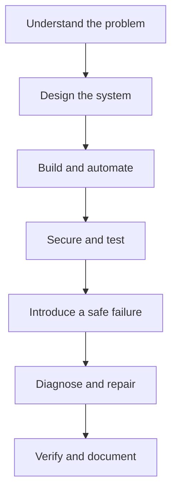

# Mid-Level Linux Portfolio Projects

Build connected Linux platforms, automate repeatable operations, troubleshoot realistic failures, and produce work you can explain in a technical interview.

The Mid-Level Linux Projects collection takes you beyond single-server administration. You will build web platforms, centralized logging, configuration management, high availability, security monitoring, disaster recovery, network services, container infrastructure, CI/CD, and an incident response environment.

You will not complete these projects by copying a list of commands. You will design each system, implement it in stages, test the complete service, introduce a controlled failure, investigate the evidence, repair the root cause, verify recovery, and document the result.

## Is This Level Right for You?

These projects are designed for you if you can already administer one Linux server without step-by-step help.

Before starting, you should be comfortable with:

- users, groups, permissions, and `sudo`;
- packages, processes, and systemd services;
- SSH and basic Linux networking;
- filesystems, mounts, and storage usage;
- firewalls and basic server security;
- logs and `journalctl`;
- Bash scripts and command-line tools;
- backups, restoration, and verification.

If you are still building these foundations, begin with the [Junior Linux Portfolio Projects](../Junior/README.md).

## What You Will Do Differently at Mid-Level

At this level, you are responsible for more than making one service work.

You will:

- connect multiple hosts, services, and data paths;
- make and defend architecture decisions;
- automate configuration and deployment;
- secure communication between systems;
- test complete application and network paths;
- centralize operational evidence;
- investigate problems from logs, metrics, processes, sockets, and configuration;
- measure availability and recovery;
- document limitations and production considerations.

## How Each Project Works

Every project follows the same engineering journey.



Inside each project, you will:

1. Understand the scenario and expected outcome.
2. Prepare the required virtual machines and network.
3. Review the architecture and data flow.
4. Record the healthy starting state.
5. Implement one verified stage at a time.
6. Read the explanation for every important command and option.
7. Compare your result with the representative expected output.
8. Run functional, security, and negative tests.
9. Automate repeatable work.
10. Introduce a controlled and reversible failure.
11. Diagnose the problem with exact commands.
12. Repair the root cause and verify recovery.
13. Clean up safely or restore the lab snapshot.
14. Turn your work into a portfolio case study.

## Choose a Project

### 01. Production LEMP Web Application Platform

Build a complete Linux web application environment using Nginx, PHP, MariaDB, TLS, firewall rules, logging, and automated configuration.

You will deploy the web, application, and database layers, secure communication, control network access, protect credentials, test the complete request path, and troubleshoot application and database failures.

**You will demonstrate:** Linux, Nginx, PHP, MariaDB, TLS, databases, networking, security, logging, and automation.

**Portfolio result:** A secured LEMP platform with a working application, repeatable deployment, passing tests, operational logs, and recovery evidence.

[Start Project 01](./01-Production-LEMP-Web-Application-Platform/README.md)

### 02. Centralized Linux Logging Platform

Build a centralized logging environment that collects events from multiple Linux servers.

You will configure log senders and a central collector, protect log transport, organize messages by host and service, apply filtering and retention policies, test delivery, investigate events, interrupt log forwarding, and recover the pipeline.

**You will demonstrate:** Linux logging, networking, log transport, retention, observability, security, and troubleshooting.

**Portfolio result:** A multi-server logging platform with secure collection, useful filtering, tested retention, search workflows, and delivery recovery.

[Start Project 02](./02-Centralized-Linux-Logging-Platform/README.md)

### 03. Automated Linux Configuration Management Platform

Use Ansible to manage several Linux servers consistently.

You will create an inventory, configure secure remote access, manage packages and users, deploy configuration files, control services, apply security settings, protect secrets, test idempotence, detect drift, and recover from a failed change.

**You will demonstrate:** Linux, Ansible, SSH, YAML, automation, configuration management, security, and testing.

**Portfolio result:** An Ansible-managed Linux fleet with reusable roles, consistent configuration, protected secrets, validation, drift correction, and rollback evidence.

[Start Project 03](./03-Automated-Linux-Configuration-Management-Platform/README.md)

### 04. Highly Available Linux Web Platform

Build a multi-server web environment with load balancing, health checks, redundancy, and tested failover.

You will deploy multiple web servers, place a load balancer in front of them, configure health-aware routing, monitor backend health, remove a node from service, observe failover, investigate an unhealthy backend, and restore redundancy.

**You will demonstrate:** Linux networking, Nginx or HAProxy, load balancing, health checks, service redundancy, high availability, and troubleshooting.

**Portfolio result:** A redundant web platform that continues serving requests during a controlled backend failure.

[Start Project 04](./04-Highly-Available-Linux-Web-Platform/README.md)

### 05. Linux Security Monitoring Platform

Build a security monitoring environment that detects suspicious activity across Linux systems.

You will monitor failed authentication, privileged actions, important file changes, unusual processes, listening ports, and service events. You will generate safe test activity, validate detections, investigate alerts, reduce false positives, and document remediation.

**You will demonstrate:** Linux security, logging, file integrity, process monitoring, alerting, incident detection, and security analysis.

**Portfolio result:** A working security monitoring platform with tested detections, investigation evidence, triage notes, and remediation results.

[Start Project 05](./05-Linux-Security-Monitoring-Platform/README.md)

### 06. Linux Disaster Recovery Platform

Design a backup and recovery system capable of restoring critical Linux services after simulated failure.

You will identify critical data and services, define recovery objectives, automate backups, verify backup integrity, simulate service loss, rebuild the affected service, restore data, measure recovery time, and compare the result with your targets.

**You will demonstrate:** Backup design, restoration, automation, disaster recovery, RTO, RPO, data integrity, and recovery testing.

**Portfolio result:** A tested recovery system with automated backups, verified restoration, measured RTO and RPO, and a usable recovery runbook.

[Start Project 06](./06-Linux-Disaster-Recovery-Platform/README.md)

### 07. Linux Network Services Infrastructure

Build a Linux network-services environment that provides DNS, DHCP, address assignment, and name resolution.

You will design an isolated network, deploy DNS and DHCP, create records and address pools, configure reservations, inspect queries and leases, test client behavior, introduce resolution and allocation failures, and restore service.

**You will demonstrate:** Linux networking, DNS, DHCP, addressing, name resolution, access control, packet inspection, and troubleshooting.

**Portfolio result:** A working network-services environment with documented addressing, tested DNS and DHCP, useful logs, and recovery evidence.

[Start Project 07](./07-Linux-Network-Services-Infrastructure/README.md)

### 08. Containerized Linux Application Platform

Build and operate a Linux server hosting containerized applications with Docker.

You will create images, deploy containers, configure networks, attach persistent storage, apply resource limits, manage configuration and secrets, add health checks, inspect logs, apply security controls, simulate failures, and recover the application.

**You will demonstrate:** Linux, Docker, images, containers, networking, persistent storage, resource controls, security, and troubleshooting.

**Portfolio result:** A secured container platform with reproducible deployment, persistent data, resource controls, health checks, and tested recovery.

[Start Project 08](./08-Containerized-Linux-Application-Platform/README.md)

### 09. Linux CI/CD Deployment Server

Build a Linux-based CI/CD environment that retrieves code, runs tests, creates an artifact, deploys an application, verifies the release, and supports rollback.

You will connect source control, create pipeline stages, manage credentials, run automated tests, build versioned artifacts, deploy to a Linux target, perform post-deployment checks, simulate a failed release, and restore the last known good version.

**You will demonstrate:** Linux, Git, CI/CD, pipeline design, testing, artifacts, automation, deployment, security, and rollback.

**Portfolio result:** A complete delivery pipeline with repeatable builds, automated tests, controlled deployment, release evidence, and verified rollback.

[Start Project 09](./09-Linux-CI-CD-Deployment-Server/README.md)

### 10. Linux Incident Response Environment

Create an isolated Linux environment with deliberate vulnerabilities or misconfigurations, then investigate and remediate a simulated incident.

You will establish a baseline, generate authorized test activity, collect evidence, build a timeline, determine the blast radius, test competing explanations, identify the root cause, contain the incident, repair the system, verify recovery, and write a post-incident report.

**You will demonstrate:** Linux troubleshooting, security, logging, evidence handling, incident response, forensic thinking, root-cause analysis, and technical reporting.

**Portfolio result:** A complete incident case file containing evidence, a timeline, root-cause analysis, containment actions, remediation, recovery tests, and prevention recommendations.

[Start Project 10](./10-Linux-Incident-Response-Environment/README.md)

## Recommended Learning Path

You can select projects based on your goals, but completing them in order gives you the strongest progression.

| Stage | Projects | What you build |
|---|---:|---|
| Application platform | 01 | An integrated web, application, and database environment |
| Central operations | 02 to 03 | Centralized logs and automated configuration management |
| Reliability and security | 04 to 05 | High availability and security monitoring |
| Recovery and networking | 06 to 07 | Disaster recovery, DNS, and DHCP infrastructure |
| Modern application delivery | 08 to 09 | A container platform and CI/CD pipeline |
| Incident response capstone | 10 | A complete investigation, recovery, and post-incident report |

## Lab Requirements

Most projects require two or more virtual machines. Each project provides its exact topology and resource requirements.

A suitable starting lab includes:

- Ubuntu Server 24.04 LTS, unless the project states otherwise;
- a computer capable of running three to five virtual machines;
- at least 16 GB of host memory for multi-server work;
- at least 80 GB of available storage;
- an isolated virtual network;
- a non-root account with `sudo` access;
- Git, SSH, and a text editor;
- virtual machine snapshots or another tested rollback method;
- internet access for approved package downloads.

You can reduce virtual machine resources when your hardware is limited. Do not remove a required server or service simply to make the diagram smaller. The implemented environment must still prove the intended architecture.

## Testing Your Work

A service showing `active` does not prove that the platform works. Test the behavior that users and connected systems depend on.

Your project tests will cover:

- configuration validation;
- service and process health;
- listening ports and network paths;
- application or protocol behavior;
- authentication and authorization;
- successful and unsuccessful requests;
- data integrity;
- automation repeatability;
- controlled failure and recovery;
- final acceptance criteria.

Record the command, expected result, actual result, and supporting evidence for important tests.

## Troubleshooting Your Failure Scenario

Every project includes a controlled failure. Do not jump directly to the repair. Investigate the system and prove the root cause.

```text
symptom
  -> impact and affected components
  -> recent changes
  -> logs, metrics, processes, sockets, files, and configuration
  -> possible causes
  -> smallest safe test
  -> confirmed root cause
  -> repair
  -> recovery verification
  -> prevention
```

Your troubleshooting record should explain what you observed, what you suspected, how you tested each possibility, what you ruled out, and which evidence confirmed the cause.

## What to Include in Your Portfolio

Your finished project should show what you built and how you know it works.

Include:

- the problem and expected outcome;
- requirements, assumptions, and constraints;
- an architecture and network diagram;
- environment and version information;
- important technical decisions;
- sanitized configuration files;
- scripts with comments and usage instructions;
- selected command output and logs;
- functional, security, negative, and recovery tests;
- the controlled failure and investigation;
- root-cause analysis;
- recovery evidence;
- measurable results;
- known limitations;
- production considerations;
- a truthful resume bullet;
- interview questions and answers.

Do not commit passwords, private keys, tokens, personal information, employer data, customer data, or real infrastructure details.

## Completion Checklist

- [ ] I understood the problem and expected outcome.
- [ ] I prepared an isolated lab with a recovery path.
- [ ] I recorded the starting state.
- [ ] I implemented the complete architecture.
- [ ] I verified every major change.
- [ ] I secured identities, network access, files, and credentials.
- [ ] I automated repeatable work.
- [ ] I tested normal, invalid, and failure conditions.
- [ ] I introduced the failure safely.
- [ ] I diagnosed the problem from evidence.
- [ ] I repaired the root cause.
- [ ] I verified recovery against the acceptance criteria.
- [ ] I removed sensitive information from the evidence.
- [ ] I documented limitations and production considerations.
- [ ] I completed cleanup or restored the lab.
- [ ] I can explain my decisions without reading the commands from the guide.

## Repository Structure

```text
Mid-Level/
├── README.md
├── 01-Production-LEMP-Web-Application-Platform/
├── 02-Centralized-Linux-Logging-Platform/
├── 03-Automated-Linux-Configuration-Management-Platform/
├── 04-Highly-Available-Linux-Web-Platform/
├── 05-Linux-Security-Monitoring-Platform/
├── 06-Linux-Disaster-Recovery-Platform/
├── 07-Linux-Network-Services-Infrastructure/
├── 08-Containerized-Linux-Application-Platform/
├── 09-Linux-CI-CD-Deployment-Server/
└── 10-Linux-Incident-Response-Environment/
```

## Continue Your Linux Journey

After completing the Mid-Level collection, continue with:

- [Senior Linux Portfolio Projects](../Senior/README.md)
- [Portfolio Capstones](../Portfolio-Capstones/README.md)
- [Linux Troubleshooting](../../03-Troubleshooting/README.md)
- [Linux Interview Preparation](../../05-Interview-Preparation/README.md)

## Contributing

Found an error or a clearer way to explain a step? Contributions that improve accuracy, safety, testing, distribution support, or accessibility are welcome.

Read the repository [Contribution Guidelines](../../CONTRIBUTING.md), [Resource Standard](../../RESOURCE-STANDARD.md), [Security Policy](../../SECURITY.md), and [Code of Conduct](../../CODE_OF_CONDUCT.md) before submitting a change.

## License

Linux World is distributed under the terms in the repository [LICENSE](../../LICENSE) and [NOTICE](../../NOTICE.md). Review those terms before copying, modifying, or redistributing the project content.

---

Ready to begin? Start with [Project 01: Production LEMP Web Application Platform](./01-Production-LEMP-Web-Application-Platform/README.md).
