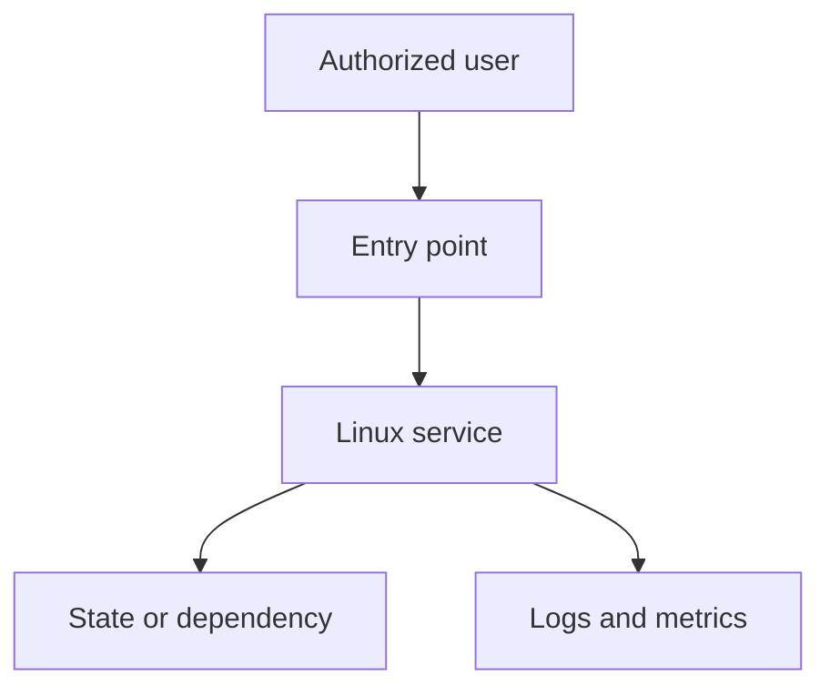

# {{PROJECT_NAME}}: Architecture

## Context and goals

Describe the user, workload, scale, security boundary, availability goal, recovery goal, and constraints.

## System context

Replace this example with the real topology. Keep secrets, real addresses, and private hostnames out of public diagrams.

## Component catalog

| Component | Responsibility | Identity | Data | Dependency | Failure impact |
| --- | --- | --- | --- | --- | --- |
| {{COMPONENT}} | {{RESPONSIBILITY}} | {{USER_OR_ROLE}} | {{DATA}} | {{DEPENDENCY}} | {{IMPACT}} |

## Flows and trust boundaries

Document source, destination, protocol, port or local interface, authentication, authorization, encryption, timeout, retry, and logs for every flow. Identify privilege transitions, administrative interfaces, secrets, untrusted input, and sensitive data.

## Availability, recovery, and capacity

Explain single points of failure, state ownership, redundancy, backup, restore, degradation, rollback, boot persistence, expected workload, data growth, resource limits, and headroom.

## Decisions and alternatives

Link ADRs. Do not hide rejected alternatives or unresolved risks.
