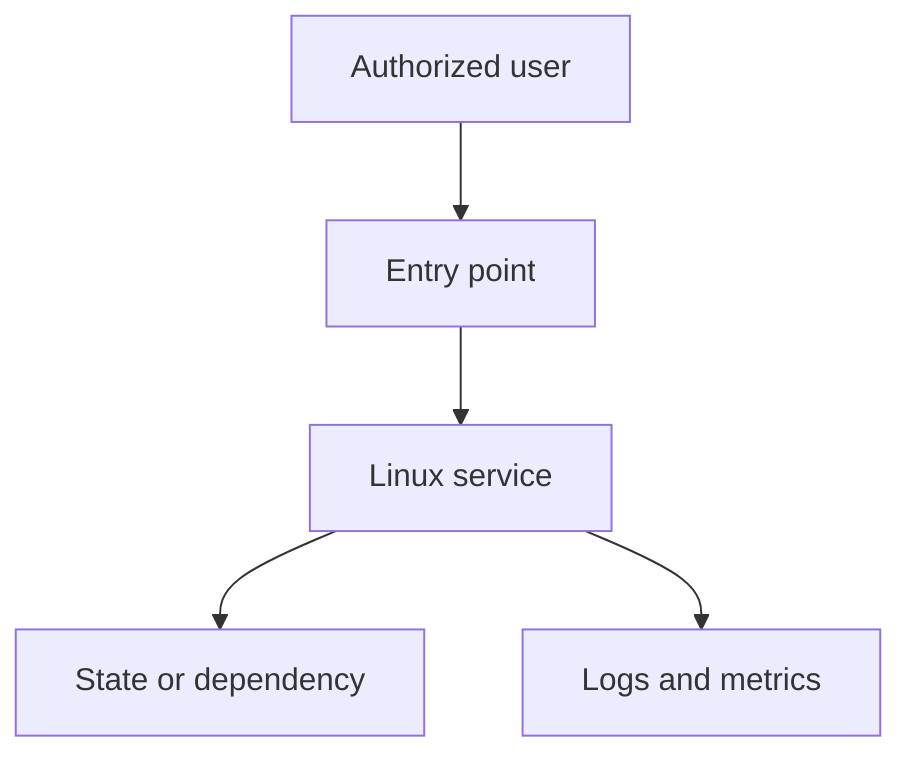

# Architecture Diagram

Replace this diagram with the project topology. Show trust boundaries, protocols, state ownership, observability, and failure boundaries. Never publish secrets or real infrastructure names.
