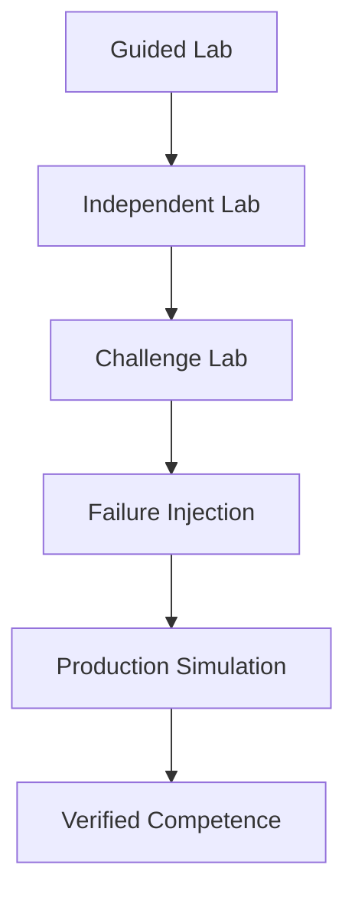

# Linux Labs

Linux Labs is the hands-on practice and assessment environment of Linux World. It helps learners move from reading about Linux to proving that they can administer, investigate, recover and document Linux systems safely.

Labs are organized by teaching method and difficulty. A lab develops or assesses a defined skill. A project combines many skills into a larger implementation.

> Use only an isolated lab system that is owned or explicitly authorized. Never run destructive exercises on a personal workstation, shared server or production environment.

## Start here

1. Read [How to Use the Labs](How-to-Use-the-Labs.md).
2. Confirm the [Environment Requirements](Environment-Requirements.md).
3. Read [Lab Safety and Isolation](Lab-Safety-and-Isolation.md).
4. Use the [Lab Selection Guide](Lab-Selection-Guide.md).
5. Review [Assessment and Scoring](Assessment-and-Scoring.md).
6. Copy the [Progress Tracker](Progress-Tracker.md).
7. Complete a lab, run its validation, reset the environment and record evidence.

## Lab collections

| Collection | Purpose | Answer visibility |
| --- | --- | --- |
| [Guided Labs](Guided-Labs/) | Teach skills with commands, explanations and checkpoints | Full guidance during the lab |
| [Independent Labs](Independent-Labs/) | Test application of previously taught skills | Requirements and limited hints |
| [Challenge Labs](Challenge-Labs/) | Combine several domains and require design choices | Constraints, acceptance tests and delayed solutions |
| [Failure Injection Labs](Failure-Injection-Labs/) | Create controlled faults and practise evidence-based recovery | Injection procedure, safety guard and sealed recovery solution |
| [Production Simulations](Production-Simulations/) | Recreate multi-system operational responsibility | Scenario updates, decision gates and post-exercise review |
| [Lab Files](Lab-Files/) | Supply reusable environments, fixtures and validation tools | Shared technical materials |
| [Solutions](Solutions/) | Explain reference approaches and alternatives | Open only after a documented attempt |

## Progression

Production simulations begin at Mid-Level. Junior learners should first develop safe execution, verification and recovery habits in smaller environments.

## Competency domains

- System foundations and package management
- Identity, authentication and access control
- Processes, services, systemd and boot
- Storage, filesystems, LVM, capacity and recovery
- Networking, DNS, SSH, firewalls and packet analysis
- Security, hardening, auditing and mandatory access controls
- Bash and Python administration automation
- Logs, monitoring, performance and resource pressure
- Backup, restoration, incident response and operational handover

## Evidence of completion

A completed lab should contain the Lab ID, environment, start and finish times, commands or decisions, validation output, score, failures encountered, cleanup result and a short reflection. Passing a command is not enough. The learner must prove the final state and explain the result.

## Repository relationship

The learning path teaches concepts, command references support recall, troubleshooting develops diagnostic method, projects build complete systems, interview preparation supports assessment, and engineer notebooks record operational work. Labs provide controlled practice and measurable proof.
