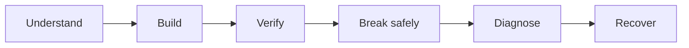
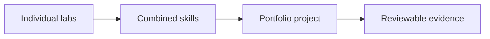

# Linux World Labs

Practice Linux in realistic environments, understand what every command changes, troubleshoot failures, and build the confidence to operate Linux systems independently.

Linux World Labs contains 352 hands-on labs across Junior, Mid-Level, and Senior levels. The journey begins with terminal navigation and progresses through Linux administration, automation, networking, containers, security, reliability, disaster recovery, architecture, and production incident simulations.

You will not simply read about Linux. You will work inside it.

## Learn Linux by Doing

Every lab begins with a mission. You may need to restore access to a shared directory, investigate a failed service, recover a full filesystem, trace a DNS problem, repair a deployment, or respond to a simulated security incident.

You will inspect the starting environment, make controlled changes, verify the result, create a safe failure, diagnose it with evidence, repair the root cause, and prove that the system recovered.

The goal is not to memorize commands. The goal is to understand how Linux behaves, recognize when it is unhealthy, and know how to investigate it.

## 352 Labs, One Complete Learning Journey

| Level | Labs | Focus | Begin |
|---|---:|---|---|
| Junior | 83 | Linux foundations, administration, storage, networking, Bash, monitoring, and common failures | [Explore Junior Labs](./Junior/README.md) |
| Mid-Level | 126 | Advanced administration, services, automation, containers, observability, security, and incident response | [Explore Mid-Level Labs](./Mid-Level/README.md) |
| Senior | 143 | Performance, reliability, high availability, identity, security engineering, Kubernetes, recovery, architecture, and incident simulations | [Explore Senior Labs](./Senior/README.md) |
| **Total** | **352** | Linux practice from first commands to advanced engineering scenarios |  |

## Choose Your Starting Point

### Junior Labs

Start here if you are new to Linux or still need guided practice with core administration tasks.

Junior labs explain commands and options carefully. You will learn how to navigate Linux, manage files and users, control permissions, install software, operate services, work with storage, configure networking, write Bash scripts, inspect logs, monitor resources, and troubleshoot common problems.

| Labs | Area |
|---|---|
| 001 to 034 | [Linux Fundamentals and Command Line](./Junior/01-Linux-Fundamentals-and-Command-Line/README.md) |
| 035 to 043 | [Storage](./Junior/02-Storage/README.md) |
| 044 to 057 | [Networking](./Junior/03-Networking/README.md) |
| 058 to 068 | [Bash and Automation](./Junior/04-Bash-and-Automation/README.md) |
| 069 to 083 | [Logs, Monitoring, and Troubleshooting](./Junior/05-Logs-Monitoring-and-Troubleshooting/README.md) |

**Your outcome:** You can use and administer a Linux system, verify your changes, and troubleshoot common failures.

[Start with Lab 001: Linux Terminal Navigation](./Junior/01-Linux-Fundamentals-and-Command-Line/001-Linux-Terminal-Navigation/README.md)

### Mid-Level Labs

Start here when you can administer one Linux server and want to operate services, automate configuration, and investigate problems across connected components.

Mid-Level labs give you more responsibility. You will work with advanced Bash, systemd, LVM, RAID, routes, firewalls, web servers, TLS, centralized logging, performance tools, Docker, Ansible, CI/CD, security monitoring, and incident evidence.

| Labs | Area |
|---|---|
| 084 to 105 | [Advanced Linux Administration](./Mid-Level/01-Advanced-Linux-Administration/README.md) |
| 106 to 117 | [Storage Administration](./Mid-Level/02-Storage-Administration/README.md) |
| 118 to 133 | [Networking](./Mid-Level/03-Networking/README.md) |
| 134 to 143 | [Web and Application Services](./Mid-Level/04-Web-and-Application-Services/README.md) |
| 144 to 159 | [Logging and Observability](./Mid-Level/05-Logging-and-Observability/README.md) |
| 160 to 171 | [Docker and Containers](./Mid-Level/06-Docker-and-Containers/README.md) |
| 172 to 188 | [Ansible and Configuration Management](./Mid-Level/07-Ansible-and-Configuration-Management/README.md) |
| 189 to 196 | [CI/CD and Operations](./Mid-Level/08-CI-CD-and-Operations/README.md) |
| 197 to 209 | [Security and Incident Response](./Mid-Level/09-Security-and-Incident-Response/README.md) |

**Your outcome:** You can operate, automate, secure, and troubleshoot Linux systems across services and hosts.

[Explore Mid-Level Labs](./Mid-Level/README.md)

### Senior Labs

Start here when you are comfortable operating Linux systems and want to solve complex reliability, performance, security, recovery, and architecture problems.

Senior labs are driven by symptoms and scenarios. You will not always receive the solution path in advance. You will decide what to inspect, form possible explanations, test them safely, contain the impact, recover service, and recommend prevention work.

| Labs | Area |
|---|---|
| 210 to 229 | [Advanced Troubleshooting and Performance](./Senior/01-Advanced-Troubleshooting-and-Performance/README.md) |
| 230 to 243 | [Reliability Engineering](./Senior/02-Reliability-Engineering/README.md) |
| 244 to 253 | [High Availability](./Senior/03-High-Availability/README.md) |
| 254 to 265 | [Observability](./Senior/04-Observability/README.md) |
| 266 to 275 | [Identity and Access Engineering](./Senior/05-Identity-and-Access-Engineering/README.md) |
| 276 to 288 | [Security Engineering](./Senior/06-Security-Engineering/README.md) |
| 289 to 304 | [Containers and Kubernetes](./Senior/07-Containers-and-Kubernetes/README.md) |
| 305 to 314 | [Infrastructure Automation](./Senior/08-Infrastructure-Automation/README.md) |
| 315 to 325 | [Disaster Recovery](./Senior/09-Disaster-Recovery/README.md) |
| 326 to 335 | [Architecture and Engineering Scenarios](./Senior/10-Architecture-and-Engineering-Scenarios/README.md) |
| 336 to 352 | [Senior Incident Simulations](./Senior/11-Senior-Incident-Simulations/README.md) |

**Your outcome:** You can engineer, secure, troubleshoot, recover, and design reliable Linux infrastructure.

[Explore Senior Labs](./Senior/README.md)

## What You Will Find Inside a Lab

Each lab gives you a complete path from concept to recovery:

1. A plain-language explanation of the concept.
2. A realistic mission and clear goal.
3. The required environment and prerequisites.
4. Safety notes and a recovery path.
5. Commands that show the starting state.
6. Exact implementation commands or scripts.
7. Explanations of important commands, options, paths, and values.
8. Representative expected output.
9. Verification after every major change.
10. A deliberate and reversible problem.
11. Diagnostic commands and evidence collection.
12. A root-cause repair.
13. Recovery verification.
14. Safe cleanup.
15. A short knowledge check.

You always know what you are changing, why you are changing it, what result to expect, and how to confirm that it worked.

## Labs and Portfolio Projects

Labs teach focused skills. Portfolio projects combine those skills into larger systems.

| Labs help you | Portfolio projects ask you to |
|---|---|
| Learn and practice one capability | Combine several capabilities |
| Follow a guided mission | Solve a larger technical problem |
| Understand commands and system behavior | Make and defend design decisions |
| Practice controlled failure and recovery | Build complete portfolio evidence |

The progression is simple:

When you are ready to combine what you have learned, continue to [Linux Portfolio Projects](../04-Projects/README.md).

## Before You Begin

Use an isolated lab environment that you own or are authorized to use.

Recommended options include:

- VirtualBox, VMware, Hyper-V, UTM, or another local hypervisor;
- an approved cloud virtual machine;
- a disposable Linux machine;
- containers when the lab explicitly supports them.

Ubuntu Server 24.04 LTS is the primary learning environment unless a lab states otherwise. Package names, service names, configuration paths, and commands may differ across distributions.

Before your first lab:

1. Read [Lab Environment Setup](./LAB-ENVIRONMENT.md).
2. Read [Lab Safety](./LAB-SAFETY.md).
3. Create the required virtual machine or machines.
4. Confirm that you have console or snapshot recovery.
5. Choose the level that matches your current experience.
6. Open the level README and select your first lab.

## Work Safely

Some labs change permissions, authentication, firewalls, routes, disks, filesystems, services, boot settings, and scheduled tasks.

- Never run destructive exercises on production or shared systems.
- Take snapshots before high-risk changes.
- Keep console access available while changing SSH or firewall settings.
- Confirm device names before partitioning or formatting storage.
- Use only the test users, paths, devices, and services named in the lab.
- Apply resource limits during performance and stress exercises.
- Read scripts before running them with `sudo`.
- Stop when the target or expected effect is unclear.
- Complete the cleanup or rollback section.

Read the full [Lab Safety Guide](./LAB-SAFETY.md) before starting.

## How to Know You Completed a Lab

A lab is complete when you can:

- explain the concept in your own words;
- describe the starting state;
- explain the important commands and options;
- show that the required verification passed;
- reproduce the controlled failure safely;
- diagnose it from evidence;
- identify and repair the root cause;
- prove that the system recovered;
- clean up the environment safely.

Watching a demonstration or copying commands is not completion. Completion means you understand what changed and can prove the result.

## Document Your Progress

Save enough evidence to remember what you did and explain it later.

Useful evidence includes:

- the lab number and title;
- the date and Linux environment;
- selected command output;
- configuration changes;
- verification results;
- the failure symptom;
- diagnostic findings;
- the confirmed root cause;
- recovery evidence;
- a short explanation in your own words.

Never publish passwords, tokens, private keys, personal information, employer information, customer data, or sensitive infrastructure details.

Use the [Progress Tracker](./PROGRESS-TRACKER.md) to record completed labs.

## Repository Layout

The labs are organized by level, then by subject, then by lab number. See the complete [Labs Folder Architecture](./FOLDER-ARCHITECTURE.md) for the recommended repository structure.

## Continue Through Linux World

- [Start Here](../00-Start-Here/README.md)
- [Beginner to Advanced](../01-Beginner-to-Advanced/README.md)
- [Commands and Cheat Sheets](../02-Commands-and-Cheat-Sheets/README.md)
- [Troubleshooting](../03-Troubleshooting/README.md)
- [Portfolio Projects](../04-Projects/README.md)
- [Interview Preparation](../05-Interview-Preparation/README.md)

## Contributing

Found an error, unsafe instruction, broken command, or clearer explanation? Contributions are welcome.

Read the repository [Contribution Guidelines](../CONTRIBUTING.md), [Resource Standard](../RESOURCE-STANDARD.md), [Security Policy](../SECURITY.md), and [Code of Conduct](../CODE_OF_CONDUCT.md) before submitting a change.

## License

Linux World is distributed under the terms in the repository [LICENSE](../LICENSE) and [NOTICE](../NOTICE.md). Review those terms before copying, modifying, or redistributing this content.

---

Ready to begin? Open [Lab 001: Linux Terminal Navigation](./Junior/01-Linux-Fundamentals-and-Command-Line/001-Linux-Terminal-Navigation/README.md).
