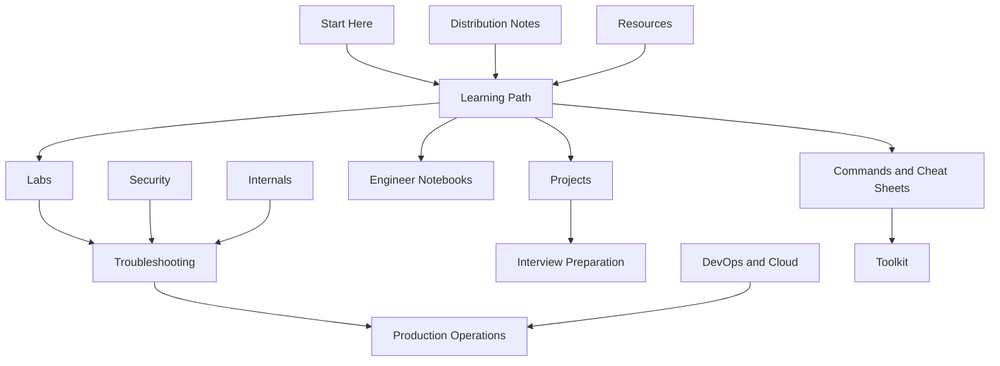

# Linux World Content Architecture

Linux World connects structured learning with reference material, hands-on practice, professional preparation, and production engineering.

## Learning

The Learning Path provides the main progression from Linux foundations to advanced operational work. Commands and Cheat Sheets support fast lookup, while Engineer Notebooks provide compact visual revision.

## Practice

Labs isolate specific skills in controlled environments. Projects combine multiple skills into complete working systems suitable for deeper practice and portfolio evidence.

## Diagnosis

Troubleshooting develops investigation and recovery skills at junior, mid-level, and senior levels. Security and Internals provide the deeper knowledge required to understand complex failures.

## Professional readiness

Interview Preparation evaluates explanation, command use, administration, troubleshooting, design judgment, and production thinking.

## Production engineering

DevOps and Cloud applies Linux to delivery systems, cloud platforms, containers, Kubernetes, platform engineering, and SRE. Production Operations covers on-call work, monitoring, capacity, change, recovery, incidents, and postmortems.

## Shared support

Toolkit provides reusable scripts and operational templates. Distribution Notes records verified differences across supported Linux families. Resources connects readers to authoritative documentation and further learning.
