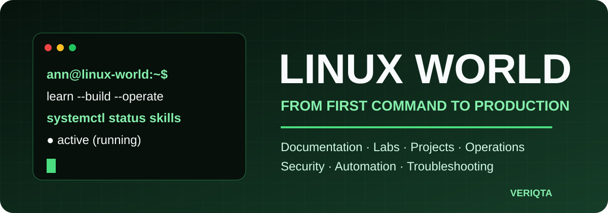
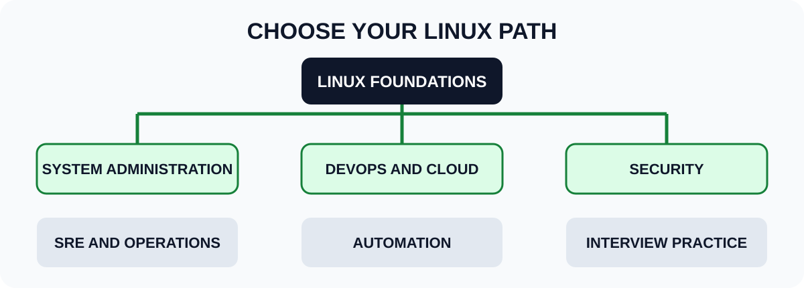
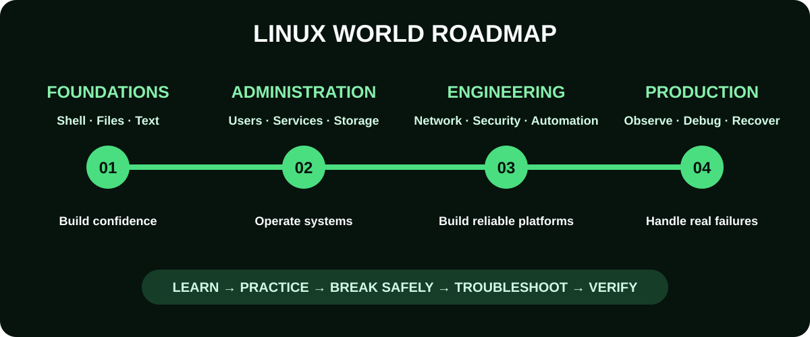

<div align="center">



# Linux World

### Learn Linux from the command line to production operations.

[](LICENSE)
[](#choose-your-learning-path)
[](#distribution-strategy)
[](#contributing)
[](https://github.com/veriqta)

**Documentation • Labs • Projects • Troubleshooting • Administration • Security • Automation • Production Engineering**

[Start Here](00-Start-Here/) · [Beginner to Advanced](01-Beginner-to-Advanced/) · [Roadmap](ROADMAP.md) · [Projects](04-Projects/) · [Troubleshooting](03-Troubleshooting/) · [Contribute](CONTRIBUTING.md)

</div>

---

## Welcome to Linux World

Linux World is a practical, production-focused Linux knowledge base for learners, system administrators, DevOps engineers, cloud engineers, platform engineers, SREs, security professionals, and anyone who wants to understand how Linux really works.

This repository is designed to take a reader from opening a terminal for the first time to operating Linux systems with confidence. It combines clear documentation, guided labs, failure scenarios, projects, command references, troubleshooting workflows, and production practices in one structured place.

This is not a collection of disconnected commands. Every major topic should help you answer four questions:

1. What does this Linux concept do?
2. How do I use it safely?
3. How does it fail?
4. How is it applied in a real production environment?

> [!NOTE]
> The repository is growing in public. Completed sections will contain lessons, labs, expected output, verification steps, troubleshooting guidance, and further practice.

## Why Linux World exists

Many Linux resources either stop at basic commands or assume too much prior knowledge. Linux World connects the missing layers:

- Foundations for complete beginners
- System administration for working engineers
- Internals for deeper understanding
- Troubleshooting based on evidence, not guesswork
- Security and hardening practices
- Bash and Python automation
- Linux use in cloud, containers, Kubernetes, CI/CD, and SRE
- Portfolio-ready projects that prove practical skill

## Who this repository is for

| Reader | What you will gain |
| --- | --- |
| Complete beginner | A guided route from installation to confident terminal use |
| Linux learner | Structured practice, labs, command explanations, and checkpoints |
| System administrator | Operational guides for users, services, storage, networking, security, and recovery |
| DevOps or cloud engineer | Linux skills used in servers, pipelines, containers, cloud platforms, and automation |
| SRE or platform engineer | Troubleshooting, observability, performance analysis, reliability, and incident response |
| Security professional | Permissions, access control, auditing, hardening, and forensic foundations |
| Interview candidate | Scenario questions, practical exercises, and senior-level troubleshooting cases |

## Distribution strategy

Linux World uses **Ubuntu Server LTS** as the primary teaching environment. One stable baseline prevents beginners from fighting package managers, service defaults, paths, and security policies before they understand the underlying concept.

The repository is not Ubuntu-only. Where commands or behavior differ, lessons include clearly labeled equivalents for:

| Family | Distributions covered | Typical package command |
| --- | --- | --- |
| Debian family | Ubuntu Server, Debian | `apt` |
| RHEL family | Rocky Linux, AlmaLinux, Red Hat Enterprise Linux | `dnf` |
| Fedora | Fedora Server and Workstation | `dnf` |

Arch Linux, openSUSE, Alpine Linux, Kali Linux, and other specialized distributions may appear in comparison guides or relevant projects. They are not separate beginner tracks. This keeps the core path consistent while teaching transferable Linux knowledge.

> [!TIP]
> Start with Ubuntu Server. After completing the foundations and administration tracks, repeat selected labs on Rocky Linux to learn the most important Debian-family and RHEL-family differences.

## Start here

New readers should begin with [00-Start-Here](00-Start-Here/). It explains the prerequisites, lab setup, safety rules, study routes, progress tracking, and how to use Linux World.

### 1. Prepare your lab

Choose one safe environment:

- A virtual machine using VirtualBox, VMware, UTM, or Hyper-V
- A cloud virtual machine with strict cost controls
- Windows Subsystem for Linux for command-line practice
- A spare computer that does not contain important data
- A local container for short, disposable experiments

Do not run destructive labs on a production server or your main computer.

### 2. Follow the tracks in order

```text
Foundations → Administration → Networking → Security
            → Scripting → Troubleshooting → Production Linux
```

### 3. Complete the work

For each topic:

- Read the concept guide.
- Type the commands yourself.
- Compare your output with the expected output.
- Complete the guided lab.
- Break the lab in the controlled failure exercise.
- Diagnose and repair it.
- Record what you learned in your own notes.

### 4. Build projects

Projects turn commands into evidence of skill. Start with beginner projects, then move to operational and production simulations.

## Choose your learning path



| Goal | Recommended route |
| --- | --- |
| Learn Linux from the beginning | [Start Here](00-Start-Here/) → [Beginner to Advanced](01-Beginner-to-Advanced/) → [Labs](07-Labs/) → [Projects](04-Projects/) |
| System administration | [Beginner to Advanced](01-Beginner-to-Advanced/) → [Commands and Cheat Sheets](02-Commands-and-Cheat-Sheets/) → [Troubleshooting](03-Troubleshooting/) → [Production Operations](11-Production-Operations/) |
| DevOps and cloud | [Beginner to Advanced](01-Beginner-to-Advanced/) → [Toolkit](12-Toolkit/) → [DevOps and Cloud](10-DevOps-and-Cloud/) → [Projects](04-Projects/) |
| SRE and operations | [Beginner to Advanced](01-Beginner-to-Advanced/) → [Troubleshooting](03-Troubleshooting/) → [Internals](09-Internals/) → [Production Operations](11-Production-Operations/) |
| Security | [Beginner to Advanced](01-Beginner-to-Advanced/) → [Security](08-Security/) → [Internals](09-Internals/) → [Security Labs](07-Labs/) |
| Interview preparation | [Beginner to Advanced](01-Beginner-to-Advanced/) → [Interview Preparation](05-Interview-Preparation/) → [Projects](04-Projects/) |

## What Linux World covers



### Linux foundations

- What Linux is and how distributions differ
- Installing Linux and preparing a safe lab
- Terminal, shell, prompt, command anatomy, and help systems
- Filesystem hierarchy and paths
- Files, directories, links, globbing, quoting, and redirection
- Viewing, creating, copying, moving, and deleting data
- Searching with `find`, `locate`, `grep`, and regular expressions
- Standard input, output, errors, pipes, and exit status
- Text processing with `cut`, `sort`, `uniq`, `tr`, `wc`, `sed`, and `awk`
- Editors, archives, compression, checksums, and downloads

### Users, groups, and permissions

- Users, groups, UIDs, GIDs, and account databases
- Ownership and permission bits
- Symbolic and numeric modes
- `sudo`, root access, and least privilege
- Special permissions, SUID, SGID, and sticky bit
- Access control lists and default ACLs
- Password aging, login policies, and account lifecycle
- PAM foundations and authentication flow
- Safe privilege troubleshooting

### System administration

- Processes, signals, jobs, priorities, and resource limits
- `systemd`, units, targets, timers, dependencies, and journal logs
- Package management and repository trust
- Environment variables, profiles, and shell startup files
- Time, locale, hostname, and system identity
- Scheduled work with cron and systemd timers
- Kernel modules, boot flow, GRUB, and initramfs
- Hardware discovery and device management
- Logs, rotation, retention, and audit trails

### Storage and filesystems

- Disks, partitions, filesystems, inodes, and mount points
- `lsblk`, `blkid`, `fdisk`, `parted`, `mkfs`, and `mount`
- Persistent mounts with `/etc/fstab`
- LVM, volume growth, snapshots, and recovery planning
- Swap, RAID concepts, and encrypted storage
- Disk usage, quotas, inode exhaustion, and cleanup
- NFS and shared storage foundations
- Filesystem checks, corruption risks, and recovery workflows
- Backup types, restore testing, and disaster recovery

### Linux networking

- Interfaces, IP addresses, subnets, routes, ports, and sockets
- DNS resolution and `/etc/hosts`
- `ip`, `ss`, `ping`, `traceroute`, `dig`, `curl`, and `tcpdump`
- NetworkManager, Netplan, and persistent configuration
- SSH keys, configuration, tunneling, and file transfer
- Firewalls with `nftables`, `ufw`, and `firewalld`
- HTTP, TLS, reverse proxies, and load-balancing foundations
- Network namespaces and virtual networking
- Systematic network troubleshooting

### Linux security

- Threat models and attack surface
- Secure installation and baseline hardening
- SSH hardening and privileged access
- File integrity and sensitive-data handling
- SELinux and AppArmor foundations
- Firewall policy and service exposure
- Patch management and vulnerability response
- Auditing with `auditd` and journal evidence
- Secrets, keys, certificates, and rotation
- Incident containment and evidence preservation
- CIS benchmark concepts and configuration validation

### Shell scripting and automation

- Bash syntax, variables, arrays, tests, loops, and functions
- Arguments, input validation, exit codes, and traps
- Safe scripting modes and defensive shell practices
- Logging, temporary files, concurrency, and idempotency
- Parsing text without fragile pipelines
- Automated user, service, storage, and backup tasks
- Python for Linux automation
- Configuration management foundations
- Testing scripts with ShellCheck and automated checks

### Troubleshooting and operations

- A repeatable investigation framework
- Boot failures and emergency targets
- High CPU, load, memory pressure, and OOM events
- Full disks, inode exhaustion, I/O latency, and filesystem errors
- Service crashes, dependency failures, and restart loops
- DNS, routing, firewall, connection, and TLS failures
- Permission, ownership, authentication, and `sudo` failures
- Package and repository failures
- Time drift, certificate expiry, and scheduled-task failures
- Evidence collection with metrics, logs, traces, events, and system state
- Mitigation, recovery, verification, and prevention

### Performance and observability

- The USE and RED methods
- CPU scheduling, load average, memory, cache, swap, and I/O
- `top`, `htop`, `vmstat`, `iostat`, `pidstat`, `sar`, and `perf`
- Logs, metrics, traces, profiles, and correlation
- Capacity, baselines, saturation, and bottlenecks
- eBPF foundations and safe production observation
- Alert quality, dashboards, and operational signals

### Linux for DevOps, cloud, and containers

- Linux on AWS, Azure, and Google Cloud
- Cloud-init and image preparation
- Docker and container runtime foundations
- Namespaces, cgroups, capabilities, and seccomp
- Linux inside Kubernetes nodes and containers
- Git, build tools, CI/CD runners, and deployment hosts
- Infrastructure as code and configuration management
- Reverse proxies, application services, and databases
- Immutable infrastructure and patching strategies

### Production engineering

- Server build standards and operational readiness
- Reliability, availability, recovery, and blast radius
- Change management and safe deployment practices
- Monitoring, alerting, escalation, and on-call readiness
- Backups, restore drills, high availability, and disaster recovery
- Capacity planning and performance regression analysis
- Incident response, timelines, postmortems, and follow-up actions
- Fleet management, drift detection, and policy enforcement
- Production debugging case files

### Interviews and assessments

- Beginner, intermediate, and senior question banks
- Command interpretation exercises
- Scenario-based troubleshooting
- Hands-on administration assessments
- Linux system design discussions
- Senior Linux operations challenges
- Answer explanations and evaluation rubrics

## Linux projects

Each project should include a problem statement, architecture, prerequisites, build steps, expected output, verification, failure tests, security considerations, cleanup, and extension challenges.

| Level | Project | Skills demonstrated |
| --- | --- | --- |
| Beginner | Build a Linux home lab | Installation, terminal use, networking, snapshots |
| Beginner | User and permission manager | Users, groups, permissions, validation |
| Beginner | System information reporter | Bash, `/proc`, commands, formatted output |
| Intermediate | Automated backup and restore system | Archives, checksums, scheduling, recovery tests |
| Intermediate | Secure SSH server | Keys, firewall, hardening, audit evidence |
| Intermediate | Web server operations lab | Nginx, systemd, logs, TLS, troubleshooting |
| Intermediate | Disk and log capacity monitor | Filesystems, thresholds, alerts, rotation |
| Advanced | Production server build pipeline | Automation, idempotency, validation, security |
| Advanced | Linux performance investigation lab | CPU, memory, disk, network, evidence analysis |
| Advanced | Multi-server incident simulation | Failure injection, triage, mitigation, postmortem |
| Advanced | Container internals laboratory | Namespaces, cgroups, capabilities, isolation |
| Advanced | Self-healing service with guardrails | systemd, health checks, backoff, alerting |

## Documentation standard

Every complete technical guide in Linux World should contain:

- Purpose and learning objectives
- Required knowledge and prerequisites
- Concept explanation from first principles
- Commands with line-by-line explanations
- Files and directories involved
- Expected output, including possible differences
- Verification steps after every major change
- Common errors and their causes
- Security and production considerations
- Guided lab and independent practice
- Controlled failure and recovery exercise
- Cleanup or rollback steps
- Knowledge check and next topic
- References to authoritative upstream documentation

## Troubleshooting and operations

Linux World uses one investigation model across all operational case files:

```text
Symptom
  ↓
Confirm impact and blast radius
  ↓
Check recent changes and current system state
  ↓
Collect metrics, logs, events, traces, and command output
  ↓
Form and test hypotheses
  ↓
Narrow the failure domain and identify root cause
  ↓
Mitigate → Recover → Verify → Prevent recurrence
```

The goal is not to memorize random fixes. The goal is to collect evidence, understand the system, reduce risk, and restore service safely.

## Explore Linux World

Choose the area that matches what you want to learn, practise, build, or improve.

### Begin your Linux journey

Follow [Beginner to Advanced](01-Beginner-to-Advanced/) for a structured 20-part journey from first principles to Linux administration, troubleshooting, automation, security, and a complete final project.

The path covers terminal use, files, permissions, processes, services, packages, storage, networking, security, scripting, automation, troubleshooting, performance, containers, cloud, and production practices.

### Find and understand commands

Use [Commands and Cheat Sheets](02-Commands-and-Cheat-Sheets/) to find commands by task instead of memorizing disconnected syntax.

Each detailed command guide explains:

- What the command does
- When to use it
- Important options
- Practical examples
- Expected output
- Common errors
- Safety considerations
- Production use

Short cheat sheets are available for fast revision and operational reference.

### Develop troubleshooting skills

Explore [Troubleshooting](03-Troubleshooting/) through progressive difficulty levels:

- **Junior:** Files, permissions, packages, processes, services, disk space, and basic networking
- **Mid-level:** Boot problems, systemd dependencies, CPU, memory, I/O, DNS, routing, authentication, and logs
- **Senior:** Kernel behavior, performance incidents, containers, cgroups, capacity, production outages, and complex failure chains

Case files, decision trees, and controlled failure exercises help readers investigate from evidence instead of guessing.

### Build practical projects

Use [Projects](04-Projects/) to turn Linux knowledge into working systems and portfolio evidence.

Projects are organized for junior, mid-level, and senior engineers and cover:

- System administration
- Bash and Python automation
- Networking
- Security
- DevOps and CI/CD
- Cloud infrastructure
- Containers
- SRE and observability
- Incident response
- Production-style capstones

Every complete project includes requirements, architecture, build instructions, verification, failure testing, troubleshooting, security considerations, cleanup, and extension challenges.

### Prepare for Linux interviews

Use [Interview Preparation](05-Interview-Preparation/) for:

- Junior Linux interviews
- Mid-level Linux interviews
- Senior Linux interviews
- Command exercises
- Practical administration tasks
- Troubleshooting scenarios
- Mock interviews
- Strong answer explanations
- Evaluation rubrics

Senior material emphasizes Linux internals, performance, system design, reliability, security, recovery, and incident leadership.

### Study the engineer notebooks

The [Engineer Notebooks](06-Engineer-Notebooks/) provide compact visual learning and revision resources.

- **Junior Linux Notebook:** Foundations, commands, administration, networking, and introductory troubleshooting
- **Senior Linux Notebook:** Internals, production behavior, failure modes, performance, reliability, security, recovery, and architecture decisions

### Practise in Linux labs

Use [Labs](07-Labs/) to build hands-on confidence through:

- Guided labs
- Independent exercises
- Challenge labs
- Failure-injection labs
- Production simulations
- Security exercises
- Verified solutions

Labs are designed for disposable environments. Never perform destructive exercises on an important or production system.

### Strengthen Linux security

Explore [Security](08-Security/) for Linux hardening, privileged access, SSH, firewalls, SELinux, AppArmor, auditing, secrets, certificates, vulnerability management, compliance baselines, and incident forensics.

### Understand Linux internals

Explore [Internals](09-Internals/) to understand how Linux works beneath ordinary commands and configuration files.

Topics include boot, kernel behavior, processes, scheduling, memory management, filesystems, I/O, networking, namespaces, cgroups, system calls, and performance internals.

### Apply Linux to DevOps and cloud engineering

Use [DevOps and Cloud](10-DevOps-and-Cloud/) to study Linux in:

- CI/CD systems
- Cloud servers
- Containers
- Kubernetes nodes
- Configuration management
- Infrastructure automation
- Platform engineering
- SRE
- Observability

### Operate production systems

Use [Production Operations](11-Production-Operations/) for runbooks, playbooks, on-call practices, operational readiness, monitoring, capacity planning, patching, backups, disaster recovery, incident response, and postmortems.

### Use scripts and operational templates

The [Toolkit](12-Toolkit/) provides tested Bash and Python utilities, health checks, diagnostic tools, monitoring helpers, security checks, and reusable operational templates.

### Compare Linux distributions

Use [Distribution Notes](13-Distribution-Notes/) for verified differences among Ubuntu Server, Debian, Rocky Linux, Red Hat Enterprise Linux, and Fedora.

### Continue learning

Visit [Resources](14-Resources/) for the glossary, official documentation, trusted books, useful websites, and carefully selected video channels.

## Repository status

| Area | Status |
| --- | --- |
| README and repository policies | Available |
| Start Here | Available |
| Beginner to Advanced | In progress |
| Commands and Cheat Sheets | Planned |
| Troubleshooting | Planned |
| Projects | Planned |
| Interview Preparation | Planned |
| Engineer Notebooks | Planned |
| Labs | Planned |
| Security and Internals | Planned |
| DevOps, Cloud, and Production Operations | Planned |

Status labels should be updated as material is published. The roadmap will prioritize completeness and accuracy over releasing unfinished lessons.

## How to use commands safely

> [!WARNING]
> Linux commands can modify permissions, erase data, stop services, remove packages, or make a machine unbootable. Read a command before running it. Understand the target path. Back up important data. Use disposable labs for risky exercises.

Recommended habits:

- Never paste an unknown command into a privileged shell.
- Avoid working as `root` unless the task requires it.
- Check variables and paths before recursive operations.
- Create snapshots before boot, disk, firewall, or authentication labs.
- Record the original configuration before editing it.
- Validate syntax before restarting a service.
- Keep a second terminal open during remote access changes.
- Test backups by restoring them.

## Contributing

Contributions that improve clarity, correctness, safety, accessibility, or distribution coverage are welcome.

Before opening a pull request:

1. Read [CONTRIBUTING.md](CONTRIBUTING.md).
2. Search existing issues and pull requests.
3. Follow [RESOURCE-STANDARD.md](RESOURCE-STANDARD.md).
4. Test every command in a clean lab.
5. State the distributions and versions tested.
6. Remove secrets, private addresses, tokens, and personal data.
7. Explain what changed and why.

Good first contributions include fixing unclear instructions, adding verified expected output, correcting broken links, testing an existing lab on another supported distribution, and improving accessibility.

## Security

Do not open a public issue for a vulnerability that could put users at risk. Follow the private reporting process in [SECURITY.md](SECURITY.md).

All examples must use placeholder credentials and non-sensitive test data. Never commit real tokens, passwords, private keys, cloud credentials, or personal information.

## Authoritative references

Linux World favors upstream and vendor documentation, including:

- [The Linux kernel documentation](https://docs.kernel.org/)
- [GNU documentation](https://www.gnu.org/manual/manual.html)
- [Ubuntu Server documentation](https://documentation.ubuntu.com/server/)
- [Debian Administrator's Handbook](https://www.debian.org/doc/manuals/debian-handbook/)
- [Red Hat Enterprise Linux documentation](https://docs.redhat.com/en/documentation/red_hat_enterprise_linux/)
- [Fedora documentation](https://docs.fedoraproject.org/)
- [systemd manual pages](https://www.freedesktop.org/software/systemd/man/)
- Local manual and information pages, such as `man`, `info`, and `--help`

External links are starting points, not substitutes for testing. Commands and behavior can vary by distribution, release, package version, hardware, and system configuration.

## License

Linux World is governed by the [Linux World Proprietary License](LICENSE).

Copyright © 2026 Ann Felix and VERIQTA. All rights reserved. Public availability does not grant permission to copy, modify, redistribute, republish, translate, teach from, commercialize, or create derivative works from the repository. See [NOTICE.md](NOTICE.md) for the public copyright and use notice.

## Support Linux World

If this repository helps you:

- Star the repository.
- Share it with another Linux learner.
- Open an issue when something is unclear or incorrect.
- Contribute a verified improvement.
- Follow [@veriqta](https://github.com/veriqta) for future learning resources.

---

<div align="center">

**Linux is learned by using it, breaking it safely, understanding the evidence, and repairing it.**

Created and maintained by **VERIQTA**

</div>
